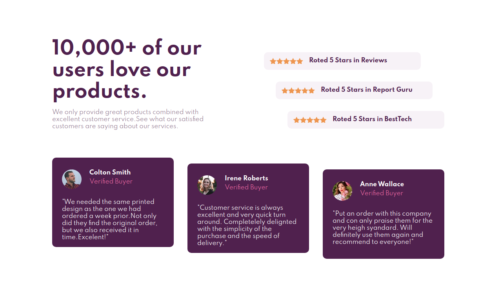
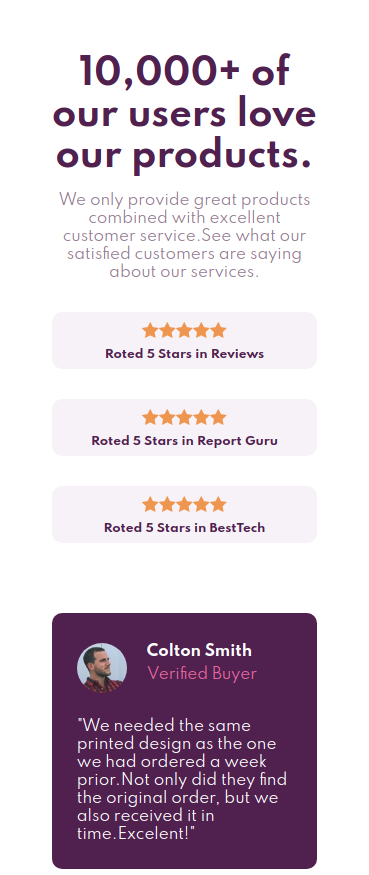

# Social proof section

## Sobre o projeto

Esta é uma solução do frontend do Mentor. O objetivo do desafio era criar uma "Social proof section" e torna-lá o mais próximo possível do projeto proposto.

## Layout Desktop

## layout Mobile

# Estilização utilizada

## Cores

### Primária

- Very Dark Magenta: hsl(300, 43%, 22%) 
- Soft Pink: hsl(333, 80%, 67%)

### Neutra

- Dark Grayish Magenta: hsl(303, 10%, 53%) 
- Light Grayish Magenta: hsl(300, 24%, 96%) 
- White: hsl(0, 0%, 100%)

## tipografia

### Body

- Font size: 15px

### Font

- Family: Spartan
- Weights: 400, 500, 700

# Tecnologias utilizadas

## Front end

- HTML / CSS 

Modelo de layout utilizado:

- FlexBox

## Implantação em produção

- Front end web: Netlify
  
  https://app.netlify.com/sites/socialproof01/settings/general
  
# Meu aprendizado neste projeto
  
  Com este desafio pude aprimorar minhas habilidades com a flex box e com a propriedade position.Também aprimorei meus conceitos de responsividade.Neste projeto também pude entender melhor a importância dos comentários nas linhas de códigos, que facilitam muito em uma eventual manutenção e interpretação de outros desenvolvedores.
  
# Autor

Wesley higino Pereira

https://www.linkedin.com/in/wesleyhigino/